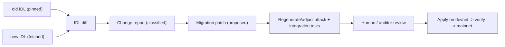

# IDL-Diff Migration (Assisted, Not Magic)

The "future-proof" pillar. When a venue (Meteora, Orca, Jupiter) ships a
breaking change, this workflow detects exactly what changed and produces a
*reviewable* migration patch + tests. It does NOT silently auto-rewrite
financial code — that would be irresponsible. The human/auditor approves.

## Why this is needed

Composed DeFi breaks when a dependency's program interface changes: a new
instruction discriminant, reordered/renamed accounts, a new required account, a
changed struct layout, or new compute requirements. Recent real examples:
Meteora `PositionV2` (70 → ~1,400 bins, on-demand byte growth) and the
`rebalance_liquidity` instruction; Token-2022 transfer-hook account
requirements.

## The workflow



### Step 1: pin and fetch IDLs

```bash
# Keep the IDL you built against under version control:
#   idl/meteora_dlmm.<version>.json
# Fetch the new on-chain IDL:
anchor idl fetch <PROGRAM_ID> --provider.cluster mainnet > idl/meteora_dlmm.new.json
```

### Step 2: classify the diff

Compare old vs new and bucket every change by **blast radius**:

| Change kind | Example | Action |
| ----------- | ------- | ------ |
| New optional account | extra `event_authority` | add to `Accounts` struct + CPI |
| New required account | new `bin_array_bitmap_ext` | add + thread through remaining accounts |
| Reordered accounts | account index shift | reorder CPI account metas |
| Renamed instruction | `add_liquidity` → `add_liquidity2` | update CPI call + discriminant |
| Struct layout change | new field in `Position` | update deserialization + size/rent |
| New arg | `shrink_mode` added | thread param from keeper/program |
| Removed/deprecated | old ix dropped | replace call site; flag for review |

Output a `MIGRATION.md` table with each change, its classification, the affected
files, and a Critical/High/Medium/Low risk tag.

### Step 3: propose the patch

For each change, emit a minimal diff to the CPI module (e.g.
`meteora-dlmm-cpi.md` call sites) and the account structs. Keep the vault's own
state and guards untouched unless the change forces it.

### Step 4: regenerate tests FIRST

Before applying, update `../templates/tests/` so the integration tests target
the new IDL. The migration is only "done" when:

- the attack matrix (A1–A9) still passes against the new venue version, and
- a fork/integration test exercises the changed instruction on real accounts.

### Step 5: gated rollout

- Apply on devnet, run full suite, then upgrade-authority (multisig) deploys.
- Never deploy a migration to mainnet with a failing or skipped attack test.

## Honest limitations (state these to the user)

- Account *semantics* changes (same name, different meaning) cannot be detected
  from the IDL alone — flag any field whose docs/comments changed for manual review.
- Math/behavioral changes inside the dependency are invisible to an IDL diff;
  rely on integration tests against the upgraded program.
- This assistant proposes and tests; a human approves the deploy.
