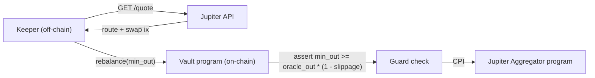

# Jupiter Ratio Rebalancing

When the vault needs to change its token ratio (e.g. it closed a position and
holds 100% token X but the target is 50/50), it swaps via Jupiter. This is the
proven pattern for in-vault rebalancing.

Jupiter Swap API: <https://dev.jup.ag/docs/swap-api/get-quote>
Host: `https://lite-api.jup.ag/swap/v1` (free, no key) or `https://api.jup.ag/swap/v1`
(with an API key via the Jupiter portal). The legacy `quote-api.jup.ag/v6` host is
retired — do not use it.

## Architecture: quote off-chain, execute on-chain (guarded)

Jupiter routing is computed off-chain (the keeper calls the Quote API). The
**program** must not trust the route blindly — it enforces a minimum-output
bound derived from the oracle, so a malicious/poisoned route cannot drain value.



## Two integration styles

### A. CPI to Jupiter aggregator program (atomic, preferred for vaults)

The vault program CPIs into the Jupiter program with the route accounts passed
as `remaining_accounts`. The vault enforces `min_out` BEFORE the swap:

```rust
pub fn rebalance_swap(ctx: Context<RebalanceSwap>, amount_in: u64, min_out: u64) -> Result<()> {
    let vault = &ctx.accounts.vault;
    require!(!vault.paused, VaultError::Paused);
    require!(amount_in <= vault.per_tx_cap, VaultError::CapExceeded);

    // Oracle-derived floor: the keeper-provided min_out must be at least the
    // fair output minus allowed slippage. This neutralizes route manipulation.
    let fair_out = crate::guards::oracle_quote(
        &ctx.accounts.oracle_in, &ctx.accounts.oracle_out, amount_in)?;
    let floor = fair_out
        .checked_mul((10_000 - vault.guard.max_slippage_bps) as u64).unwrap()
        .checked_div(10_000).unwrap();
    require!(min_out >= floor, VaultError::SlippageTooLoose);

    // record balance before, CPI swap with PDA signer, assert delta >= min_out
    let before = ctx.accounts.dst_ata.amount;
    let seeds: &[&[u8]] = &[b"vault_auth", vault.key().as_ref(), &[vault.auth_bump]];
    jupiter_cpi::route(/* CpiContext::new_with_signer(..., &[seeds]) + remaining */, amount_in, min_out)?;

    ctx.accounts.dst_ata.reload()?;
    let received = ctx.accounts.dst_ata.amount.checked_sub(before).unwrap();
    require!(received >= min_out, VaultError::SlippageExceeded);
    Ok(())
}
```

Key safety idea: even though the *route* is supplied off-chain, the program
binds the swap to an **oracle-derived `min_out`** and verifies the actual
received delta. The keeper cannot make the vault accept a bad trade.

### B. Off-chain build, on-chain verify (simpler)

If you don't want to CPI the aggregator, the keeper builds the full Jupiter swap
transaction with the vault's `vault_authority` as the user, and a separate
program instruction asserts the post-swap invariants. Less atomic; only use when
the swap and the LP move are in the same transaction or bundle.

## Keeper side (Quote API)

```ts
const quote = await (await fetch(
  `https://lite-api.jup.ag/swap/v1/quote?inputMint=${inMint}&outputMint=${outMint}` +
  `&amount=${amountIn}&slippageBps=${slippageBps}&restrictIntermediateTokens=true`
)).json();
// Pass quote.outAmount-derived min_out into the program; the program re-checks
// it against the oracle. Never let the program trust quote.outAmount alone.
```

## Rules

- `restrictIntermediateTokens=true` to avoid exotic, illiquid hops.
- The program's `min_out` floor is oracle-derived; the API slippage is only a UX
  hint, not a security boundary.
- Cap `amount_in` per transaction (`per_tx_cap`) to bound damage.
- Rebalance swaps must also respect `vault.paused` and emit an event for the
  keeper/audit trail.
